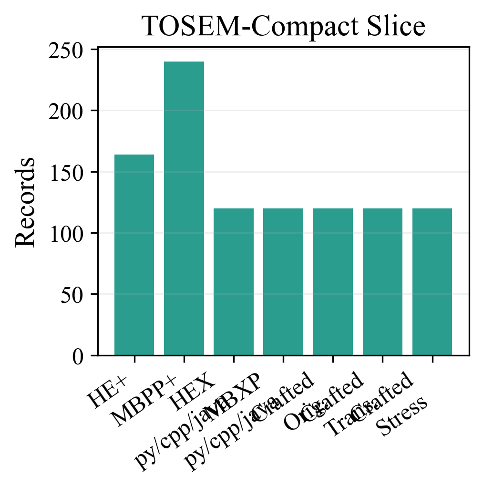
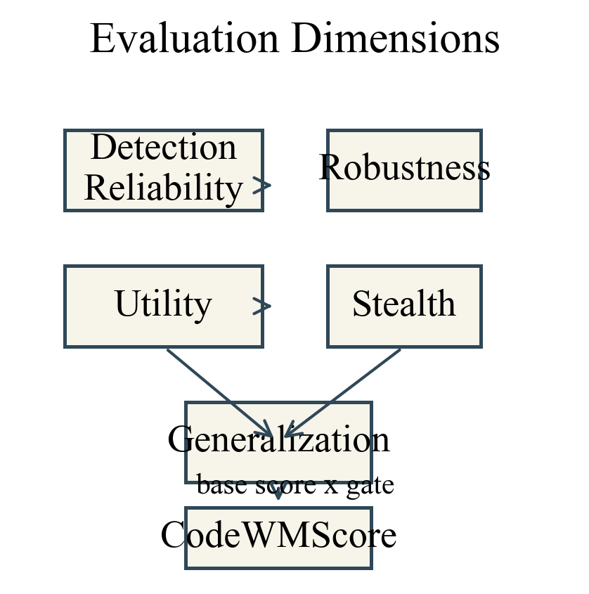

# CodeWMBench

`CodeWMBench` is an executable benchmark suite for evaluating code watermarking methods under realistic generation-time conditions. The active public release is the **TOSEM-compact** slice: four imported official baselines, four local code models, seven atomic benchmark sources, and the full five-dimensional scorecard headed by `CodeWMScore`.

The repository is organized for three use cases:

- browse the benchmark definition, dataset statistics, formulas, and summary artifacts
- regenerate figures and tables from released result artifacts without rerunning models
- rerun the compact precheck or the compact full matrix on a Linux GPU host

## What Is In Scope

The active official runtime baseline roster is:

- `stone_runtime`
- `sweet_runtime`
- `ewd_runtime`
- `kgw_runtime`

The active local model roster is:

- `Qwen/Qwen2.5-Coder-14B-Instruct`
- `Qwen/Qwen2.5-Coder-7B-Instruct`
- `bigcode/starcoder2-7b`
- `deepseek-ai/deepseek-coder-6.7b-instruct`

The active suite inventory contains:

- `HumanEval`
- `HumanEval+`
- `MBPP+`
- `HumanEval-X`
- `MBXP-5lang`
- `crafted_original`
- `crafted_translation`
- `crafted_stress`

The aggregate suite score uses the following seven atomic source groups:

- `HumanEval+`
- `MBPP+`
- `HumanEval-X (py/cpp/java slice)`
- `MBXP-5lang (py/cpp/java slice)`
- `Crafted Original`
- `Crafted Translation`
- `Crafted Stress`

`HumanEval` remains part of the documented inventory but is excluded from the aggregate suite score to avoid double-counting against `HumanEval+`.

For multilingual official-runtime comparisons, the current executable common-support slice is `python`, `cpp`, and `java`. The five-language inventory is still documented and auditable, but it is not the active official-runtime execution slice for `HumanEval-X` and `MBXP-5lang`.

## TOSEM-Compact Slice

The published compact slice keeps the benchmark structure intact while reducing wall-clock cost:

- `HumanEval+`: `164`
- `MBPP+`: `240`
- `HumanEval-X (py/cpp/java slice)`: `120`
- `MBXP-5lang (py/cpp/java slice)`: `120`
- `Crafted Original`: `120`
- `Crafted Translation`: `120`
- `Crafted Stress`: `120`

The compact public and crafted slices are deterministic, versioned inputs stored under [`data/compact/collections`](data/compact/collections) and [`data/compact/crafted`](data/compact/crafted). `data/interim/` is reserved for build-time or diagnostic intermediates and is not part of the active public workflow.



## Repository Layout

- `codewmbench/`: orchestration, adapters, scoring, reporting, and benchmark logic
- `configs/`: active baseline configs, suite manifests, and utility configs
- `data/public/`: pinned normalized public benchmark snapshots
- `data/compact/collections/`: active TOSEM-compact benchmark collections
- `data/compact/crafted/`: active crafted benchmark snapshots used to build compact collections
- `docs/`: public documentation, formulas, datasets, artifacts, and reproduction guides
- `results/figures/`: dataset statistics figures plus reserved directories for regenerated full-run summaries
- `results/tables/`: dataset statistics tables plus reserved directories for regenerated full-run summaries
- `scripts/`: data preparation, manifest building, audits, figure export, packaging, and helper entrypoints
- `third_party/`: pinned upstream provenance manifests for the four official baselines

## Scoring

Every final report carries a `summary.scorecard` block with:

- `detection_reliability`
- `robustness`
- `utility`
- `stealth`
- `generalization`
- `CodeWMScore`

`CodeWMScore` is the primary ranking metric, but it does not replace the submetrics. It combines a weighted base score with an execution-quality gate so that high false-positive rates or severe quality collapses cannot hide behind a single strong dimension.

The exact formulas are documented in [`docs/metrics.md`](docs/metrics.md).



## Public Results And Artifacts

The public repository keeps code, compact benchmark inputs, dataset statistics, and repository-tracked summary-facing outputs. Large raw full-run outputs are distributed outside git.

- dataset statistics figures live under [`results/figures/dataset_statistics`](results/figures/dataset_statistics)
- dataset statistics tables live under [`results/tables/dataset_statistics`](results/tables/dataset_statistics)
- the repository tracks reserved export directories for full-run summaries under [`results/figures/suite_all_models_methods`](results/figures/suite_all_models_methods) and [`results/tables/suite_all_models_methods`](results/tables/suite_all_models_methods)
- in a fresh public clone, those directories may contain only README placeholders until a released raw artifact is restored or a local rerun is performed
- final full-run summary figures and tables are regenerated into those directories from the released raw artifact or a local rerun
- raw full-run artifacts are documented in [`docs/artifacts.md`](docs/artifacts.md)

Use the Level 2 reproduction path in [`docs/reproduce.md`](docs/reproduce.md) to download raw artifacts and regenerate the full-run summary figures and tables locally.

## Quick Start

Install lightweight dependencies:

```bash
pip install -r requirements.txt
```

Build and audit the active compact suite inputs:

```bash
bash scripts/fetch_runtime_upstreams.sh all
python scripts/build_suite_manifests.py
python scripts/audit_benchmarks.py --profile suite
python scripts/audit_full_matrix.py --manifest configs/matrices/suite_all_models_methods.json --profile suite_all_models_methods --skip-hf-access
```

For a clean rerun, clear transient outputs first:

```bash
python scripts/clean_suite_outputs.py --include-full-matrix --include-release-bundle
```

Run the two-stage compact precheck:

```bash
make suite-precheck
```

Run the compact full matrix:

```bash
make suite-matrix
```

Watch live progress:

```bash
make suite-monitor
```

Regenerate final full-run summary figures from finished raw results:

```bash
python scripts/render_paper_figures.py --matrix-index results/matrix/suite_all_models_methods/matrix_index.json --suite all --paper-track generation_time --require-times-new-roman --output-dir results/figures/suite_all_models_methods
```

Export full-run summary tables from finished reports:

```bash
python scripts/export_full_run_tables.py --matrix-index results/matrix/suite_all_models_methods/matrix_index.json --output-dir results/tables/suite_all_models_methods
```

Export repository-tracked dataset statistics:

```bash
python scripts/export_dataset_statistics.py
```

## Reproduction Levels

- [`docs/reproduce.md`](docs/reproduce.md): step-by-step reproduction paths
- [`docs/datasets.md`](docs/datasets.md): dataset inventory, compact slice rules, and curation notes
- [`docs/metrics.md`](docs/metrics.md): mathematical score definitions
- [`docs/baselines.md`](docs/baselines.md): official baseline provenance and fetch rules
- [`docs/artifacts.md`](docs/artifacts.md): raw artifact distribution policy
- [`docs/remote_linux_gpu.md`](docs/remote_linux_gpu.md): Linux GPU rerun workflow

## Provenance And Fetch Policy

- model weights are **not** distributed in this repository
- official baseline checkouts are **not** vendored here unless redistributable and explicitly packaged
- model weights are pulled from Hugging Face by exact model identifier
- official baselines are fetched from pinned upstream repositories using the manifests in [`third_party`](third_party)

The active compact workflow assumes reproducible local-model execution and imported official baseline adapters. API-backed execution is not part of the current public benchmark path.
